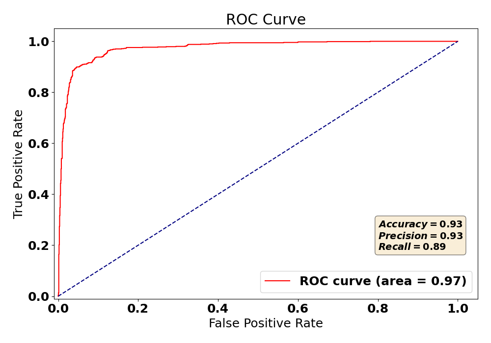

# spambase-classifier
SVM, Naive Gaussian Bayes, and Logistic Regression Classifiers for the spambase dataset \
The svm_classifier.py uses Scikit's builtin SVC to do the heavy lifting of the classification. My work constists of preprocessing the spambase.csv data. \
SVM achieves an accuracy of 93% when all the features were used.\
By selecting the most important features by weight, the classifier achieves an accuracy of 80% by only using 2 out of 57 features\
The Naive Bayes Gaussian classifier achieves an accuracy of 81% \
Scikit's Logistic Regression was used and achieved and accuracy of 93%
## How to Run
To use SVM:
python svm_classifier.py

To use Naive Bayes Gaussian and Logistic classifier:
python nbg_lr_classifier.py

### SVM ROC Curve

### SVM Accuracy Based on the Number of Features

